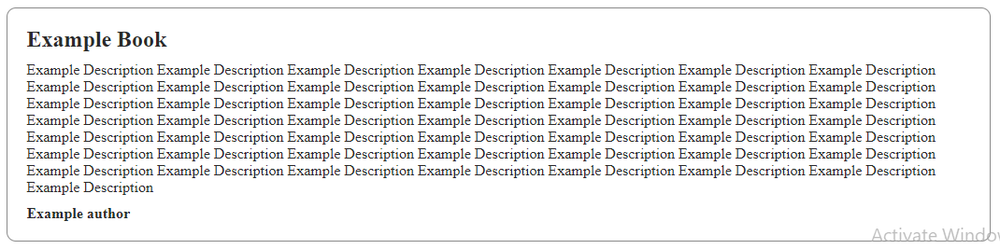

# Session 7 Task - THE MOST IMPORTANT !!!

1. One of the most important topics we covered today is modifying the DOM Tree. Read [this article](http://javascript.info/modifying-document) well and __do all the tasks at the end of it__, put them all in a `solution.js` file, upload it to Google Drive and send me the link on Trello.

2. One of the most important topics we covered today is walking the DOM Tree. Read [this article](http://javascript.info/dom-navigation) well and __do all the tasks at the end of it__, put them all in a `solution.js` file, upload it to Google Drive and send me the link on Trello.

3. In our __BookList Project__ - code is in S6 - Make the submit button `append` an Element like this

in the `book-cards` section - this element is a `div` given the class `card`. Delete any additional buttons we added and any additional code in the JS.

BONUS : Add a `remove` button to each `card` element so that it removes the whole card. Style it as you like

4. In the `S7/calculator` folder you can find a simple calculator project but missing the Javascript content of it ! Go to the `js/app.js` file there and try to accomplish the tasks specified there in order to make it alife ! If you face any problems don't hesitate to contact me at any time.